# Say Yes to Soup

*a journal, half full*

**Say Yes to Soup** is a cozy, Pokémon-style RPG for the browser about walking through the world's villages and letting culture arrive sideways: through soup, slang, small corrections, and people who disagree with each other. No combat, no timers, no fail states. You can put it down mid-sentence.

You grew up on your grandmother Nani's postcards. Then the postcards stopped. The lawyer's envelope held no money and one journal, half full — her note said the empty half was always yours. So: unpaid leave, one bag, her 1974 route. Her advice from the first letter is the whole game: *say yes to soup, ask about the bread, and if someone corrects you, thank them twice.*

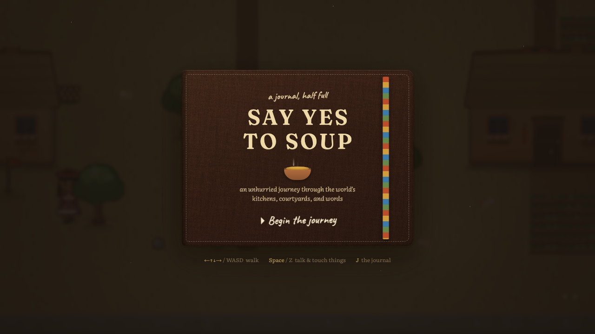

## The journey

Ten chapters, every hop a real connection: an Andean village, the Peruvian desert coast, a cargo ship across the Pacific, a Seto Inland Sea town at Tanabata, a Busan market lane, the Kerala backwaters at monsoon onset, a Zanzibar shore village, a Sicilian fishing town under Etna, a valley in Oaxaca at Día de los Muertos — and the same road home, upward.

| | |
|---|---|
| 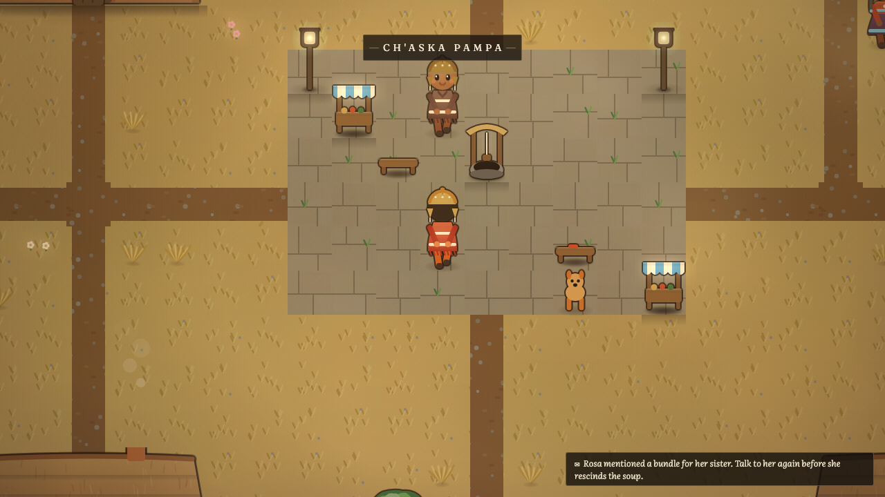 *Ch'aska Pampa, where it starts* | 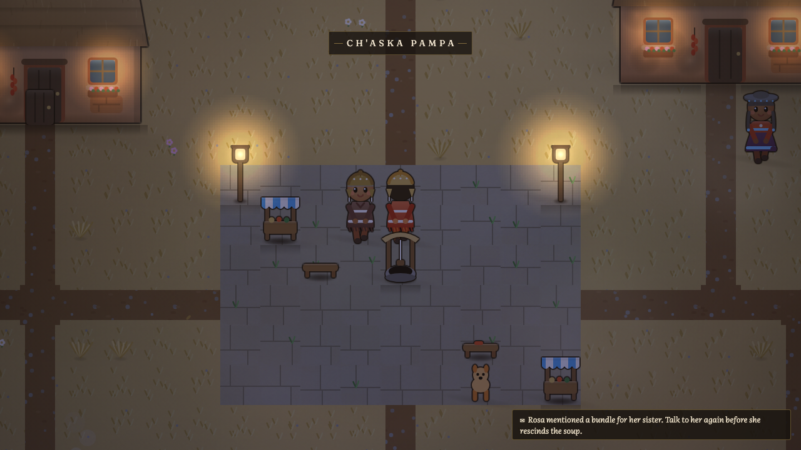 *the same plaza after dark* |
| 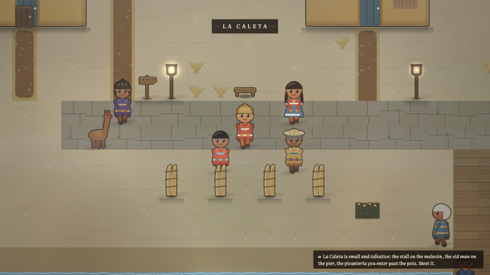 *La Caleta under the garúa* | 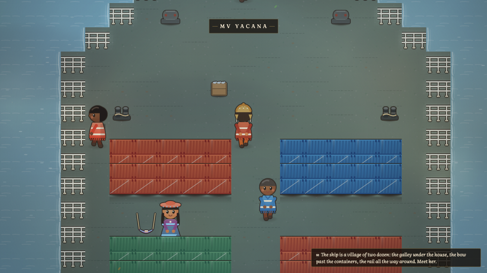 *working passage on the MV Yacana* |
| 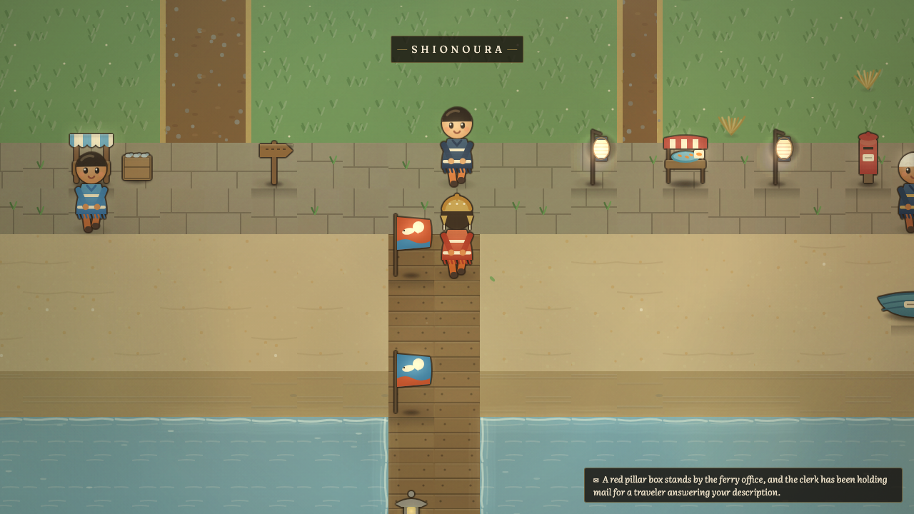 *Shionoura, tairyō-bata flying* | 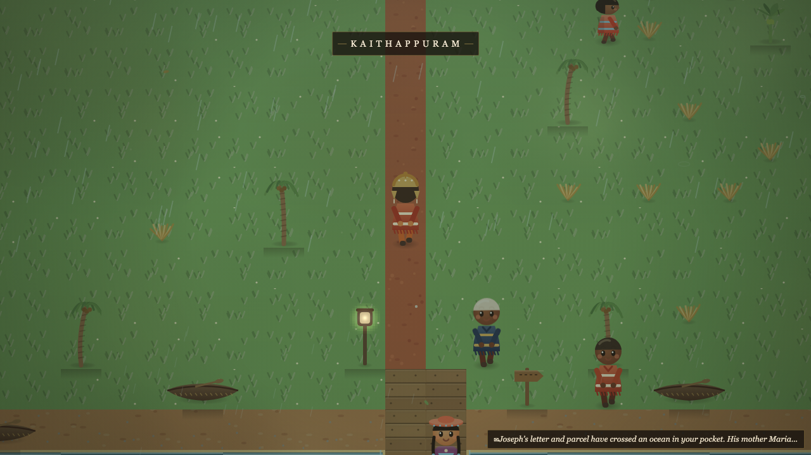 *Kaithappuram, and the monsoon actually rains* |
| 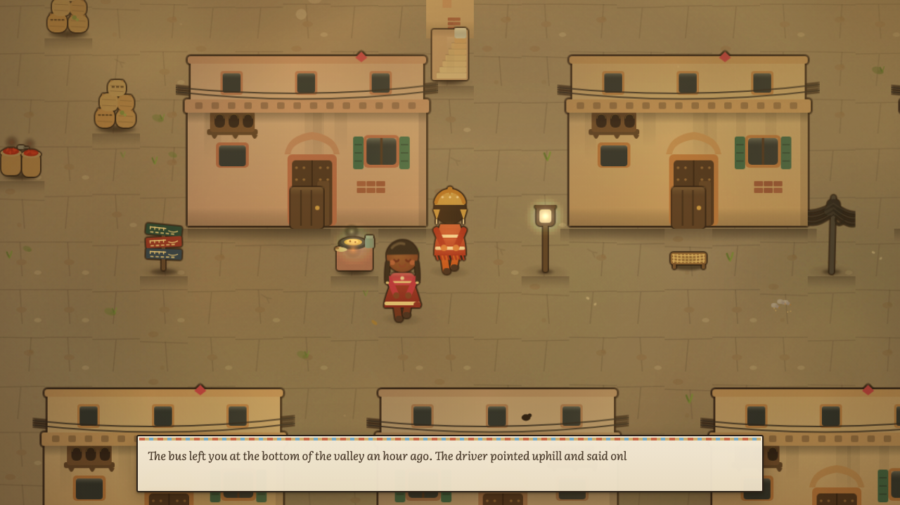 *the walled city: parantha smoke in the gali* | 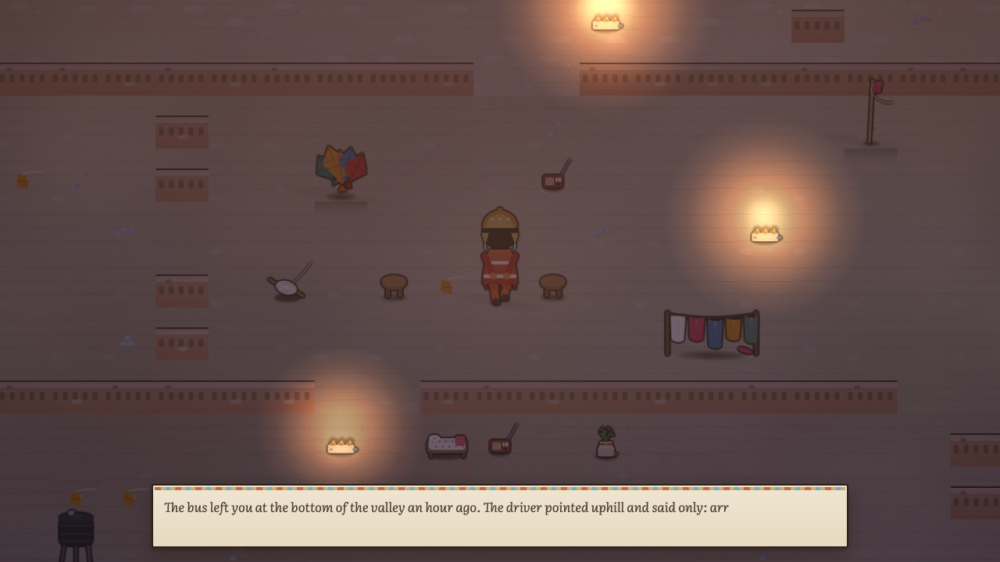 *pigeon hour over Chandni Chowk* |
| 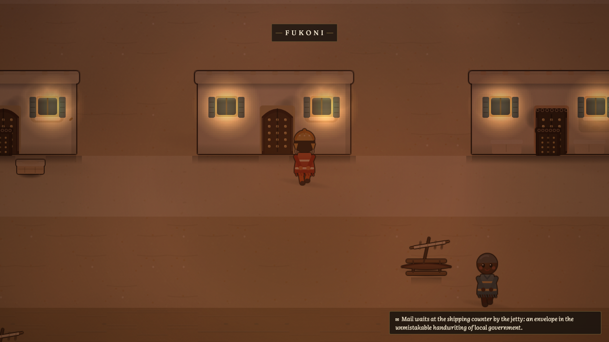 *Fukoni at lamp-light* | 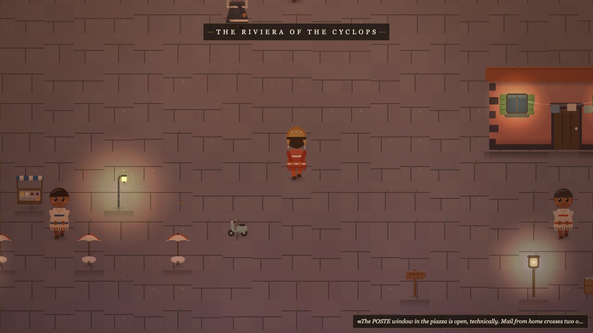 *the passeggiata hour, Etna presiding* |
| 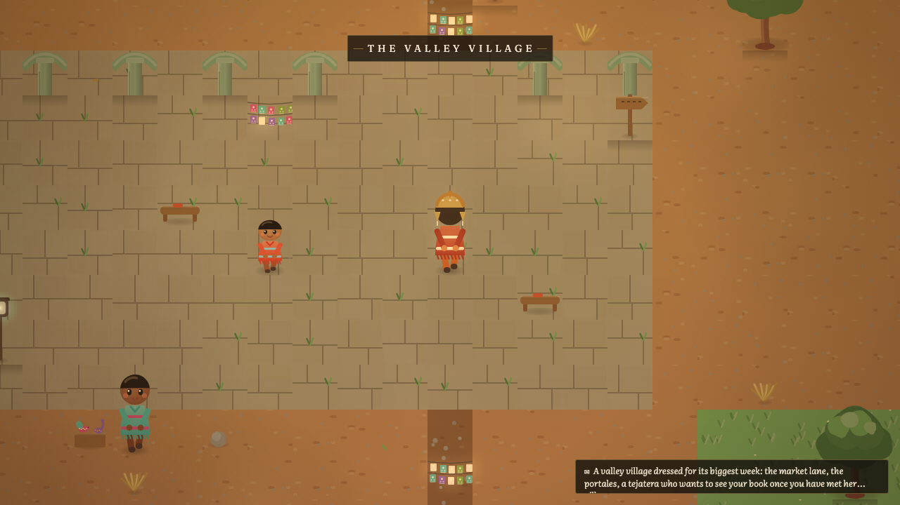 *the valley, papel picado up* | 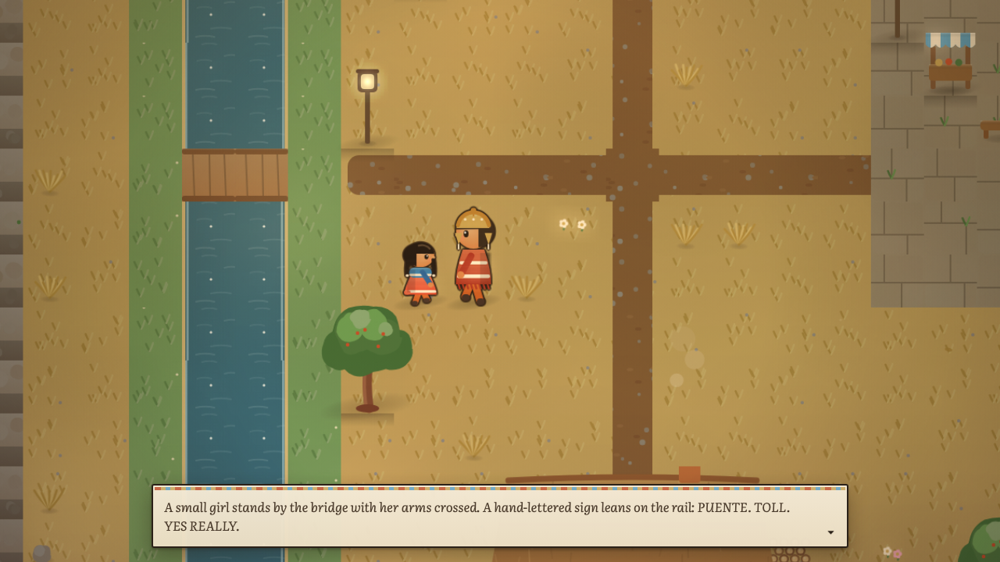 *everything you look at answers* |

## The world rhymes

What you learn uphill changes how every coast treats you. The reciprocity chain — Quechua *ayni*, the coastal *yapa*, Korean *deom*, Mexican *pilón*, and finally the Zapotec *guelaguetza* ledger that explains why Nani stopped writing — is the game's spine. The journal stitches visible threads between rhyming pages, and margin notes in Nani's hand become legible only when you hold both halves.

| | |
|---|---|
| 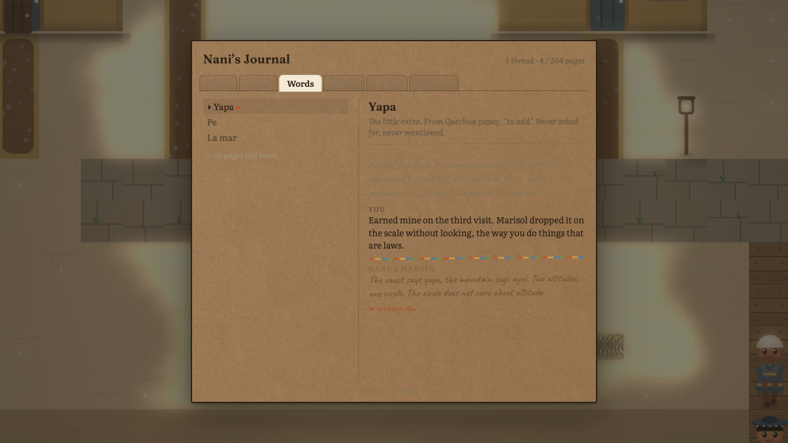 *yapa, stitched to ayni, with her margin note* | 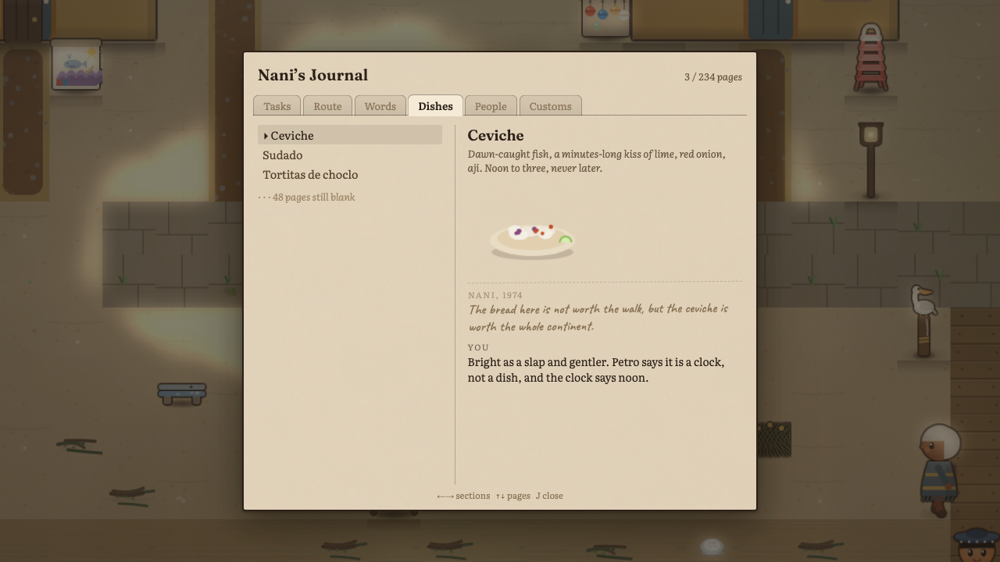 *every dish gets its little painting* |

- **Travelers find you**: Faustino trades his llama train down the mountain and bets you've forgotten the pass; Hana ferries over and pointedly never asks what you wished; Joseph walks into his mother's kitchen past his own letter; the ship's cook makes you recite the adobo order and mists up.
- **Letters chase you** around the world — including the escalating correspondence of a nine-year-old bridge magnate.
- **Every village cooks with you** once you've cared enough to learn: a watía earth oven, the lime-kiss timing of ceviche, morning dashi, a meter-long chaya pour, urojo built to a customer's call, cannoli filled at the moment and never before.
- **You can just sit down.** Any bench, baraza, fish crate, or bollard. The camera settles, the music steps aside for the wind, and the place thinks out loud around you.
- **You can hear where you are**: nine regional generative music styles (bombo, taiko, janggu, chenda, taarab, tarantella, marimba), speech babble shaped by each language's pitch and gait, footsteps that know steel decks from sand.

## Playing

```bash
npm install
npm run dev
```

Open the printed localhost URL in a modern browser (WebGPU preferred, WebGL fallback).

| Key | Action |
|---|---|
| Arrows / WASD | walk |
| Space / Z | talk, touch things, sit |
| J | the journal |
| M | mute |

## How it is built

- Vite + TypeScript and a thin custom engine (fixed-timestep 60 Hz sim, 16 px logical tiles); PixiJS handles only the final composite: screen-space lighting, bloom, iris wipes, and shimmer-free zoom over a Canvas2D-painted world.
- All world art is procedural: painterly canvas drawing at 4x resolution, no sprite sheets. All audio is synthesized WebAudio, zero audio files. The only bitmaps in the repo are a handful of CC0 paper and cloth textures dressing the UI.
- Content is data: maps are ASCII rows plus a legend; dialogue is a condition-gated node graph; one `effects` array is the entire learning system. Each chapter is a self-contained plugin folder (content, art set, minigames, weather moods, recall manifest).
- The test suite plays the game abstractly: a reachability fixpoint proves all ~200 journal pages earnable, a stuck-detector proves every reachable state leaves you a task, and a recall ledger proves every cross-chapter callback was actually planted before it pays off.

## On the cultures

Every village in this game is fictional; the texture is researched. Each region was written from a sourced content bible (see `docs/*-content-bible.md`) with explicit lists of claims to verify and clichés to refuse — no mafia Sicily, no Halloween Oaxaca, no monolithic anywhere. Getting a custom wrong in-game is never punished; the wrong branch is always the warmer scene, because that is how strangers are actually treated in most kitchens on Earth. Corrections from people who know these places better are welcome — that is rather the point of the game.

An Australia chapter is deliberately deferred until it can be researched with the care First Nations storytelling deserves; in-game, that's a letter you'll receive near the end.

## Credits

UI paper and book-cloth textures and a few engraved ornaments are CC0 from [ambientCG](https://ambientcg.com) and [FreeSVG](https://freesvg.org); see `public/assets/CREDITS.md`. Fonts are Fraunces, Literata, and Caveat via Google Fonts (OFL). Everything else, art and audio included, is generated by the game at runtime.

## License

Personal project, all rights reserved for now.
